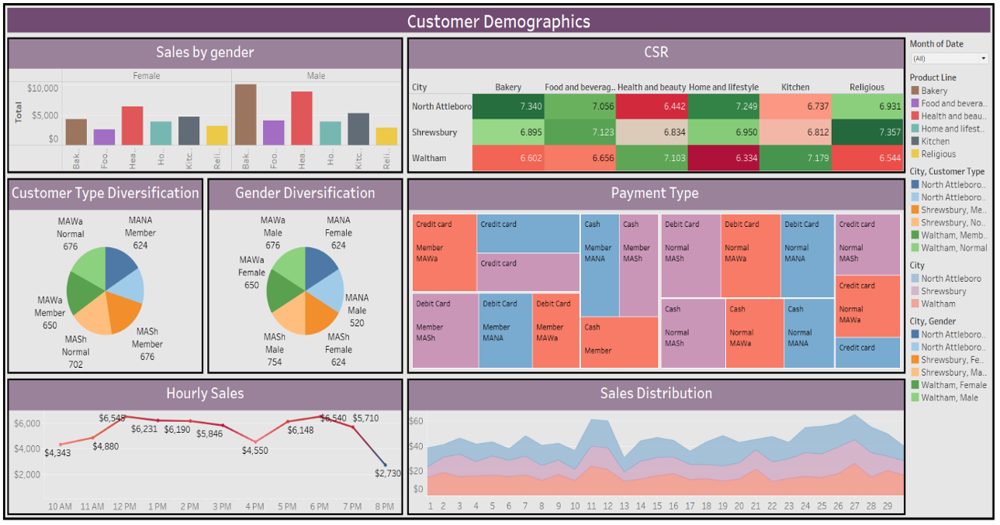
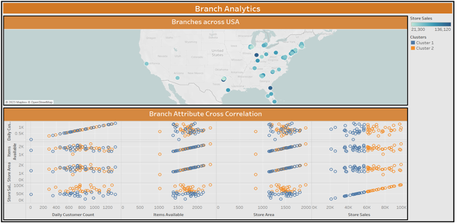
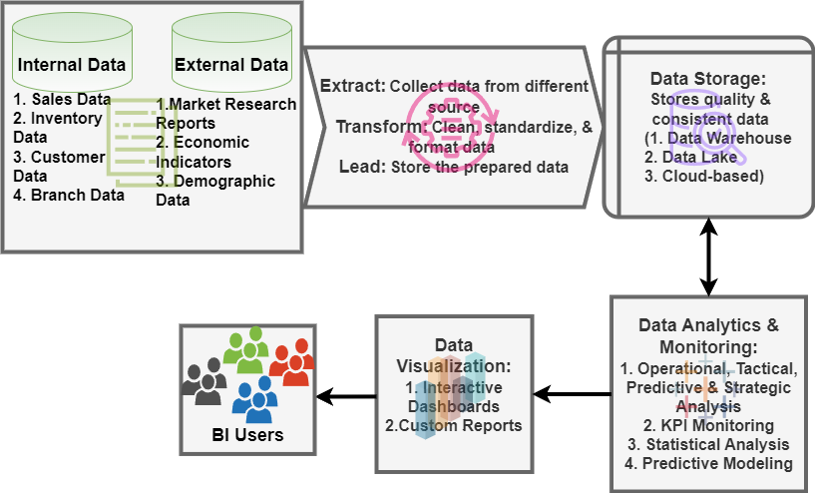

# Patel Brothers BI Transformation Project

This project demonstrates how we transformed raw sales data into actionable insights using **Tableau** for Business Intelligence and **Machine Learning** models for forecasting and decision support.  

🔗 **View Interactive Dashboard on Tableau Public**:  
[Patel Brothers BI Dashboard](https://public.tableau.com/app/profile/noopura.vaidya/viz/PatelBrother_BITransformation/Overview)

---

## 📊 Dashboards

### Overview & Key Metrics

### Customer Demographics

### Forecasting

### Branch Analytics

### BI Framework

---

## Machine Learning Models

As part of this project, we implemented machine learning models in Python to support decision-making:

1. **Sales Forecasting (Regression)**  
   - Predicts future sales trends using historical data.  
   - Model: Linear Regression  

2. **Customer Segmentation (Clustering)**  
   - Groups customers into segments based on demographics and spending patterns.  
   - Model: KMeans Clustering  

3. **Customer Attrition (Classification)**  
   - Predicts which customers are likely to stop shopping.  
   - Model: Random Forest Classifier  

📂 You can find the full implementation here:  
👉 [`ml_models.py`](./ml_models.py)

Details of model selection, evaluation, and implementation are included in the [Project Report](PateL_Brothers_Report.docx).

---

## 📂 Files
- `PateL_Brothers_Report.docx` → Full project report with methodology and results  
- Tableau Dashboard (Published on Tableau Public)  
- Supporting images for dashboards  

---

## ⚙️ Tech Stack
- **Tableau** (Data Visualization, BI Dashboards)  
- **Python** (Machine Learning, Forecasting)  
- **Excel/CSV** (Data preprocessing)  

---

✨ This project showcases how BI dashboards and ML models together can help retailers make better, data-driven decisions.

